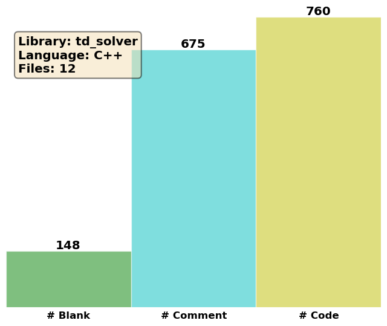

Time-dependent Solvers
======================

We will here describe the inheritance hierarchy for generating time-dependent solvers, in
order to use and extend it properly.  The runtime creation of solver objects
relies on the Factory Method pattern :cite:`Gamma1994,Alexandrescu2001`,
implemented through the generic Factory class.

TDPCMSolver
-----------
.. doxygenclass:: TDPCMSolver
   :project: PCMSolver
   :members:
   :protected-members:
   :private-members:

TDIEFSolver
-----------
.. doxygenclass:: TDIEFSolver
   :project: PCMSolver
   :members:
   :protected-members:
   :private-members:

TDSingleIEFSolver
-----------------
.. doxygenclass:: TDSingleIEFSolver
   :project: PCMSolver
   :members:
   :protected-members:
   :private-members:

TDOnsagerIEFSolver
------------------
.. doxygenclass:: TDOnsagerIEFSolver
   :project: PCMSolver
   :members:
   :protected-members:
   :private-members:

TDCPCMSolver
------------
.. doxygenclass:: TDCPCMSolver
   :project: PCMSolver
   :members:
   :protected-members:
   :private-members:

TDPCMIterativeSolver
--------------------
.. doxygenclass:: TDPCMIterativeSolver
   :project: PCMSolver
   :members:
   :protected-members:
   :private-members:

TDCPCMIterativeSolver
---------------------
.. doxygenclass:: TDCPCMIterativeSolver
   :project: PCMSolver
   :members:
   :protected-members:
   :private-members:
